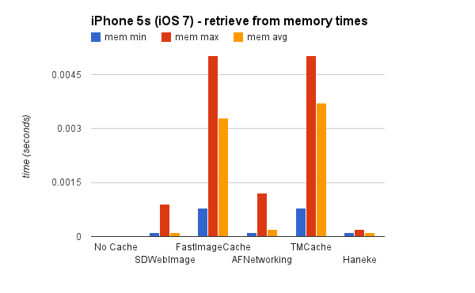
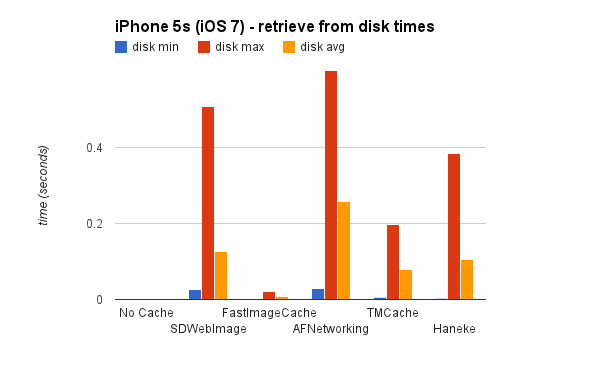
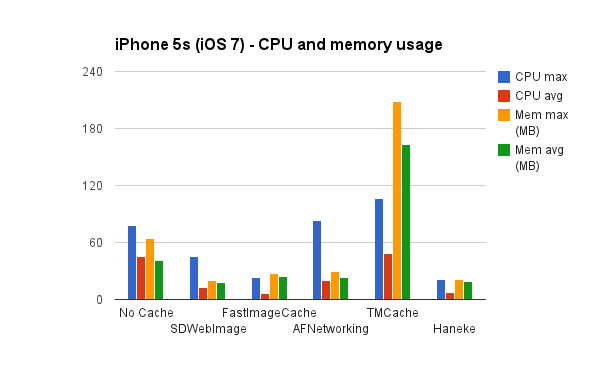
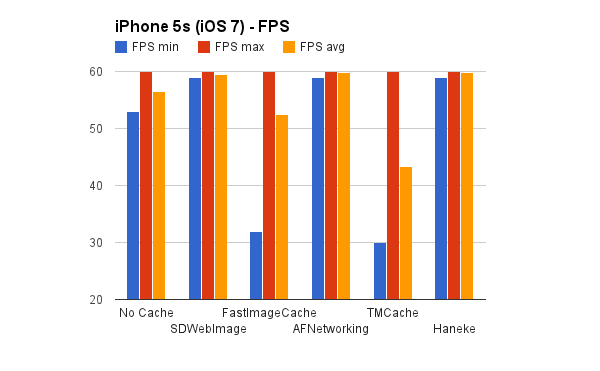
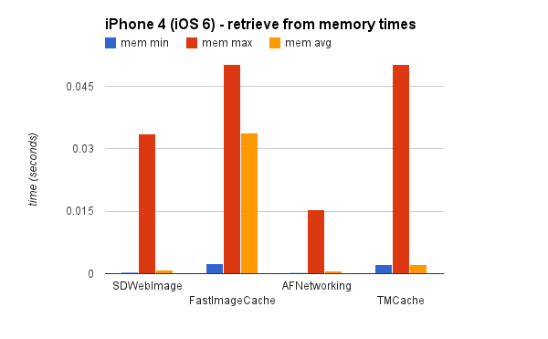
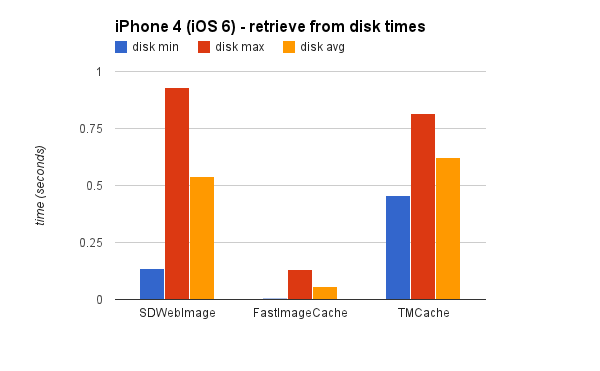
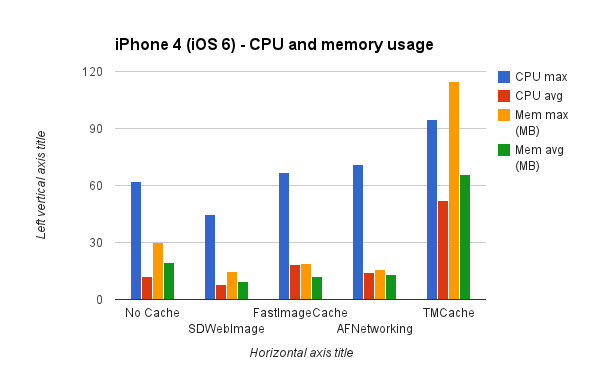
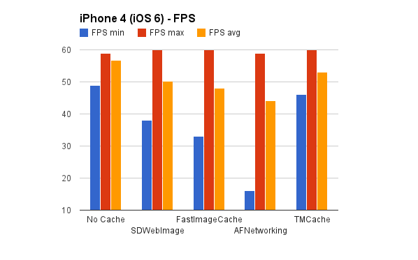

ImageCachingBenchmark
=====================

Benchmark tests for iOS image caching solutions. Article available: http://bpoplauschi.wordpress.com/2014/03/21/ios-image-caching-sdwebimage-vs-fastimage/

## Introduction
In the past years, iOS apps have become more and more visually appealing. Displaying images is a key part of that, that’s why most of them use images that need to be downloaded and rendered. Most developers have faced the need to populate table views or collection views with images. Downloading the images is resource consuming (cellular data, battery, CPU, …), so in order to minimize this the caching model appeared.

To achieve a great user experience, it’s important to understand what is going on under the iOS hood when we cache and load images.

Also, the benchmarks on the most used image caching open source libraries can be of great help when choosing your solution.

## Classical approach

- download the images asynchronously
- process images (scale, remove red eyes, remove borders, …) so they are ready to be displayed
- write them on disk
- read from disk and display them when needed

```objectivec
// assuming we have an NSURL *imageUrl and UIImageView *imageView, we need to load the image from the URL and display it in the imageView
if ([self hasImageDataForURL:imageUrl] {
  NSData *data = [self imageDataForUrl:imageUrl];
  UIImage *image = [UIImage imageWithData:imageData];
  dispatch_async(dispatch_get_main_queue(), ^{
    imageView.image = image;
  });
} else {
  [self downloadImageFromURL:imageUrl withCompletion:^(NSData *imageData, …) {
    [self storeImageData:imageData …];
    UIImage *image = [UIImage imageWithData:imageData];
    dispatch_async(dispatch_get_main_queue(), ^{
      imageView.image = image;
    });
  }];
}
```

#### FPS simple math: 

- 60 FPS is our ideal for any UI update, so the experience is flawless
- 60FPS => 16.7ms per frame. This means that if any main-queue operation takes longer than 16.7 ms, the scrolling FPS will drop, since the CPU will be busy doing something else than rendering UI.

## Downsides of the classical variant:

- **loading images** or any file **from the disk is expensive** (disk access is usually from 10.000 to 1.000.000 times slower than memory access)
- creating the **UIImage instance** will result in a **compressed version of the image mapped to a memory section**. The compressed image is small and cannot be rendered. If loaded from disk, the image is not even loaded into memory. **Decompressing** an image is also **expensive**.
- setting the image property of the imageView in this case will create a CATransaction that will be committed on the run loop. On the next run loop iteration, the **CATransaction** involves (depending on the images) creating a **copy** of any **images** which have been set as layer contents. Copying images includes:
  - **allocating buffers** for file IO and decompression
  - **reading disk data** into memory
  - **decompressing** the image data (results the raw bitmap) - **high CPU consumer**
  - **CoreAnimation** uses the decompressed data and **renders** it
- **improper byte-aligned images** are **copied** by **CoreAnimation** so that their byte-alignament is fixed and can be rendered. This isn’t stated by Apple docs, but profiling apps with Instruments shows CA::Render::copy_image even when the Core Animation instrument shows no images copied
- starting with **iOS 7**, the **JPEG hardware decoder** is **no longer accessible** to 3rd party apps. This means our apps are relying on a software decoder which is significantly slower.

## A strong iOS image cache component must:

- **download** images **asynchronously**, so the main queue is used as little as possible
- **decompress** images on a **background queue**. This is far from being trivial. See a strong article aboue [background decompression](http://www.cocoanetics.com/2011/10/avoiding-image-decompression-sickness/)
- **cache** images into **memory** and on **disk**. Caching on disk is important because the app might be closed or need to purge the memory because of low memory conditions. In this case, re-loading the images from disk is a lot faster than downloading them. Note: if you use NSCache for the memory cache, this class will purge all it’s contents when a memory warning is issued. Details about NSCache here http://nshipster.com/nscache/
- **store** the **decompressed image** on disk and in memory to avoid redoing the decompression
- use **GCD** and **blocks**. This makes the code more performant, easier to read and write. In nowadays, GCD and blocks is a must for async operations
- *nice to have: category over UIImageView for trivial integration.*
- *nice to have: ability to process the image after download and before storing it into the cache.*

#### Is Core Data a good candidate?

Here is a [benchmark of image caching using Core Data versus File System](http://biasedbit.com/filesystem-vs-coredata-image-cache/), the results are recommending the File System (as we are already accustomed to).

Just looking at the concepts listed above makes it clear that writing such a component on your own is hard, time consuming and painful. That’s why we turn to open source image caching solutions. Most of you have heard of SDWebImage or the new FastImageCache. In order to decide which one fits you best, I’ve benchmarked them and analysed how they match our list of requirements.

#### Libraries tested
- [SDWebImage](https://github.com/rs/SDWebImage)
- [FastImageCache](https://github.com/path/FastImageCache)
- [AFNetworking](https://github.com/AFNetworking/AFNetworking)
- [TMCache](https://github.com/tumblr/TMCache)
- [Haneke](https://github.com/hpique/Haneke)

*Note: AFNetworking was added to the comparison because it benefits of disk caching from iOS 7 (due to NSURLCache).*

#### Scenario:
- for each library, I made a clean install of the benchmark app, then started the app, scroll easily while all images are loaded, then scroll back and forth with different intensities (from slow to fast). I closed the app to force loading from disk cache (where available), then run the same scrolling scenario.

#### Benchmark app - project:</h6>
- the demo project source can be found on Github under the name [ImageCachingBenchmark](https://github.com/bpoplauschi/ImageCachingBenchmark), together with the charts, collected data tables and more.

### Fastest vs slowest device results
[Complete benchmark results](http://htmlpreview.github.io/?https://github.com/bpoplauschi/ImageCachingBenchmark/blob/master/tables/tables.html) can be found on the Github project. Since those tables are big, I decided to create charts using the fastest device data (iPhone 5s) and the slowest (iPhone 4).

#### iPhone 5s results

<p align="left" >
  
  
</p>

<p align="left" >
  
  
</p>

#### iPhone 4 results

<p align="left" >
  
  
</p>

<p align="left" >
  
  
</p>

#### Summary

<table style="border:0px solid black; text-align:center; font-size:12px;">
<tbody>

<tr>
<th>Results</th>
<th>SDWebImage</th>
<th>FastImageCache</th>
<th>AFNetworking</th>
<th>TMCache</th>
<th>Haneke</th>
</tr>

<tr>
<td>async download</td>
<td>&#10003;</td>
<td>&#10007;</td>
<td>&#10003;</td>
<td>&#10007;</td>
<td>&#10003;</td>
</tr>

<tr>
<td>backgr decompr</td>
<td>&#10003;</td>
<td>&#10003;</td>
<td>&#10007;</td>
<td>&#10007;</td>
<td>&#10007;</td>
</tr>

<tr>
<td>store decompr</td>
<td>&#10003;</td>
<td>&#10003;</td>
<td>&#10007;</td>
<td>&#10007;</td>
<td>&#10007;</td>
</tr>

<tr>
<td>memory cache</td>
<td>&#10003;</td>
<td>&#10003;</td>
<td>&#10003;</td>
<td>&#10003;</td>
<td>&#10003;</td>
</tr>

<tr>
<td>disk cache</td>
<td>&#10003;</td>
<td>&#10003;</td>
<td>iOS7 NSURLCache</td>
<td>&#10003;</td>
<td>&#10003;</td>
</tr>

<tr>
<td>GCD and blocks</td>
<td>&#10003;</td>
<td>&#10003;</td>
<td>&#10003;</td>
<td>&#10003;</td>
<td>&#10003;</td>
</tr>

<tr>
<td>easy to use</td>
<td>&#10003;</td>
<td>&#10007;</td>
<td>&#10003;</td>
<td>&#10007;</td>
<td>&#10003;</td>
</tr>

<tr>
<td>UIImageView categ</td>
<td>&#10003;</td>
<td>&#10007;</td>
<td>&#10003;</td>
<td>&#10007;</td>
<td>&#10003;</td>
</tr>

<tr>
<td>from memory</td>
<td>&#10003;</td>
<td>&#10007;</td>
<td>&#10003;</td>
<td>&#10007;</td>
<td>&#10003;</td>
</tr>

<tr>
<td>from disk</td>
<td>&#10007;</td>
<td>&#10003;</td>
<td>&#10007;</td>
<td>&#10007;</td>
<td>&#10007;</td>
</tr>

<tr>
<td>lowest CPU</td>
<td>&#10003;</td>
<td>&#10007;</td>
<td>&#10007;</td>
<td>&#10007;</td>
<td>&#10003;</td>
</tr>

<tr>
<td>lowest mem</td>
<td>&#10003;</td>
<td>&#10003;</td>
<td>&#10007;</td>
<td>&#10007;</td>
<td>&#10003;</td>
</tr>


<tr>
<td>high FPS</td>
<td>&#10003;</td>
<td>&#10003;</td>
<td>&#10003;</td>
<td>&#10007;</td>
<td>&#10003;</td>
</tr>

<tr>
<td>License</td>
<td>MIT</td>
<td>MIT</td>
<td>MIT</td>
<td>Apache</td>
<td>Apache</td>
</tr>

</tbody>
</table>

## Conclusions
- writing an iOS image caching component from scratch is hard
- SDWebImage and AFNetworking are solid projects, with many contributors, that are maintained properly. FastImageCache is catching up pretty fast with that.
- looking at all the data provided above, I think we can all agree **SDWebImage** is the best solution at this time, even if for some projects AFNetworking or FastImageCache might fit better. It all depends on the project's requirements.
