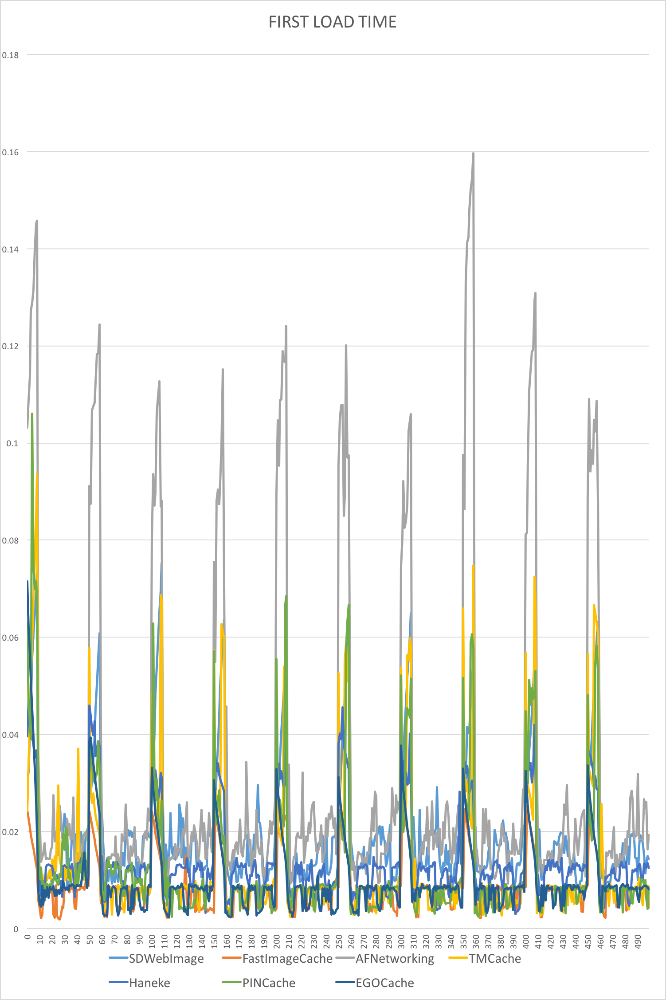

ImageCachingBenchmark
=====================

Benchmark tests for iOS image caching solutions. 

##Introduction
&nbsp;&nbsp;&nbsp;&nbsp;&nbsp;&nbsp;In the past years, iOS apps have become more and more visually appealing. Displaying images is a key part of that, that’s why most of them use images that need to be downloaded and rendered. Most developers have faced the need to populate table views or collection views with images. Downloading the images is resource consuming (cellular data, battery, CPU, …), so in order to minimize this the caching model appeared.

&nbsp;&nbsp;&nbsp;&nbsp;&nbsp;&nbsp;To achieve a great user experience, it’s important to understand what is going on under the iOS hood when we cache and load images.

&nbsp;&nbsp;&nbsp;&nbsp;&nbsp;&nbsp;Also, the benchmarks on the most used image caching open source libraries can be of great help when choosing your solution.

## Classical approach

- download the images asynchronously
- process images (scale, remove red eyes, remove borders, …) so they are ready to be displayed
- write them on disk or memory
- read from disk or memory and display them when needed

```objectivec
// assuming we have an NSURL *imageUrl and UIImageView *imageView, we need to load the image from the URL and display it in the imageView
if ([self hasImageDataForURL:imageUrl] {
  NSData *data = [self imageDataForUrl:imageUrl];
  UIImage *image = [UIImage imageWithData:imageData];
  dispatch_async(dispatch_get_main_queue(), ^{
    imageView.image = image;
  });
} else {
  [self downloadImageFromURL:imageUrl withCompletion:^(NSData *imageData, …) {
    [self storeImageData:imageData …];
    UIImage *image = [UIImage imageWithData:imageData];
    dispatch_async(dispatch_get_main_queue(), ^{
      imageView.image = image;
    });
  }];
}
```

####FPS simple math: 

- 60 FPS is our ideal for any UI update, so the experience is flawless
- 60FPS => 16.7ms per frame. This means that if any main-queue operation takes longer than 16.7 ms, the scrolling FPS will drop, since the CPU will be busy doing something else than rendering UI.

## Downsides of the classical variant:

- **loading images** or any file **from the disk is expensive** (disk access is usually from 10.000 to 1.000.000 times slower than memory access. See comparison [here](http://www.storagereview.com/introduction_ram_disks). If we refer to SSD disks, those can come closer to RAM speeds (like 10 times slower), but at this point no smartphone or tablet is equipped with an SSD unit).
- creating the **UIImage instance** will result in a **compressed version of the image mapped to a memory section**. The compressed image is small and cannot be rendered. If loaded from disk, the image is not even loaded into memory. **Decompressing** an image is also **expensive**.
- setting the image property of the imageView in this case will create a CATransaction that will be committed on the run loop. On the next run loop iteration, the **CATransaction** involves (depending on the images) creating a **copy** of any **images** which have been set as layer contents. Copying images includes:
  - **allocating buffers** for file IO and decompression
  - **reading disk data** into memory
  - **decompressing** the image data (results the raw bitmap) - **high CPU consumer**
  - **CoreAnimation** uses the decompressed data and **renders** it
- **improper byte-aligned images** are **copied** by **CoreAnimation** so that their byte-alignament is fixed and can be rendered. This isn’t stated by Apple docs, but profiling apps with Instruments shows CA::Render::copy_image even when the Core Animation instrument shows no images copied
- starting with **iOS 7**, the **JPEG hardware decoder** is **no longer accessible** to 3rd party apps. This means our apps are relying on a software decoder which is significantly slower. This was noticed by the FastImageCache team on their [Github page](https://github.com/path/FastImageCache#the-problem) and also by Nick Lockwood on a [Twitter post](https://twitter.com/nicklockwood/status/401128101049942016).

## A strong iOS image cache component must:

- **download** images **asynchronously**, so the main queue is used as little as possible
- **decompress** images on a **background queue**. This is far from being trivial. See a strong article aboue [background decompression](http://www.cocoanetics.com/2011/10/avoiding-image-decompression-sickness/)
- **cache** images into **memory** and on **disk**. Caching on disk is important because the app might be closed or need to purge the memory because of low memory conditions. In this case, re-loading the images from disk is a lot faster than downloading them. Note: if you use NSCache for the memory cache, this class will purge all it’s contents when a memory warning is issued. Details about NSCache here http://nshipster.com/nscache/
- **store** the **decompressed image** on disk and in memory to avoid redoing the decompression
- use **GCD** and **blocks**. This makes the code more performant, easier to read and write. In nowadays, GCD and blocks is a must for async operations
- *nice to have: category over UIImageView for trivial integration.*
- *nice to have: ability to process the image after download and before storing it into the cache.*

#### Advanced imaging on iOS
&nbsp;&nbsp;&nbsp;&nbsp;&nbsp;&nbsp;To find out more about imaging on iOS, how the SDK frameworks work (CoreGraphics, Image IO, CoreAnimation, CoreImage), CPU vs GPU and more, go through this [great article](http://www.slideshare.net/rsebbe/2014-cocoaheads-advimaging) by @rsebbe.

#### Is Core Data a good candidate?

&nbsp;&nbsp;&nbsp;&nbsp;&nbsp;&nbsp;Here is a [benchmark of image caching using Core Data versus File System](http://biasedbit.com/filesystem-vs-coredata-image-cache/), the results are recommending the File System (as we are already accustomed to).

<br />
<br />
<br />
#Benchmark


##Libraries tested
- [SDWebImage](https://github.com/rs/SDWebImage) - [3.7.3](https://github.com/rs/SDWebImage/releases/tag/3.7.3)
- [FastImageCache](https://github.com/path/FastImageCache) - [1.3](https://github.com/path/FastImageCache/releases/tag/1.3)
- [AFNetworking](https://github.com/AFNetworking/AFNetworking) - [2.5.4](https://github.com/AFNetworking/AFNetworking/releases/tag/2.5.4)
- [TMCache](https://github.com/tumblr/TMCache) - [2.1.0](https://github.com/tumblr/TMCache/releases/tag/2.1.0)
- [Haneke](https://github.com/hpique/Haneke) - [1.0.1](https://github.com/Haneke/Haneke/releases/tag/v1.0.1)
- [PINCache](https://github.com/pinterest/PINCache) - [2.0.1](https://github.com/pinterest/PINCache/releases/tag/2.0.1)
- [EGOCache](https://github.com/enormego/EGOCache) - [2.1.3](https://github.com/enormego/EGOCache/releases/tag/v2.1.3)

*Note: AFNetworking was added to the comparison because it benefits of disk caching from iOS 7 (due to NSURLCache).*

<br />
##TEST1 Load Time
####Get the time of first load：
######Using statistical methods
 - the APP load 50 same images each time, but those images **have different URLs**.
 
######How?
 - Open each program of Cache and wait for the finish of downloading from network.
 - Restart the APP and open each program again. Scroll to the bottom, the console will output the time of first loading of 50 images. Back to the menu and open other programs and scroll to the bottom again.
 - Repeat step 2 ten times, we have the time of load time. 

######Result
 - Raw data are here.
 - Statistical results

 <p align="left" >
  
  
 </p>

 - The reason for the pattern of statistical data is that, when you open a program,first nine images will be displayed immediately instead of being triggered by scroll the screen.It will take more time. I don’t want to delete them from the data, because I think they are also a part of the performance evaluation.

######Conclusion
&nbsp;&nbsp;&nbsp;&nbsp;&nbsp;&nbsp;From the graphs ,we can easy to see that 

 - **FastImageCache** is the best in this respect.
 - **EGOCache,PINCache,TMCache** are also good. 
 - The performance of **AFNetworking** is not satisfactory.

<br />

##Get the time of scroll load：
######Using statistical methods
 - the APP load 50 same images each time, but those images **have different URLs**.
 
######HOW?
 - After testing the time of first load, we scroll back and the console will output the time of the time of scroll load. Some of the Caches load images from disk and some of the Caches load images from memory. We will separate the data by that.

 
######Result
 - Raw data are here.
 - Statistical results
 <p align="left" >
  
  
  
  
 </p>
 
######Conclusion
&nbsp;&nbsp;&nbsp;&nbsp;&nbsp;&nbsp;From the graphs ,we can easy to see that
 
 - AFNetworking is better than SDWebImage or Haneke.
 - PINCache is better than TMCache,EGOCache,FastImageCache.
 

######Note

 - I only show the statistical graph instead of statistical data such as standard deviation and average ,because I think we can see all the result we want though the graphs clearly.


<br />
##Test2 Memory Usage
######Using statistical methods
 - The APP load 30 different images each time.

######HOW?
 - After the first load step, open each program of Cache again and scroll to the bottom, record data of memory usage at this moment. Then click to zoom in and record the data, then end this program of Cache ,go back to the main menu and record the data of memory usage.
 - Restart the APP, open each program and keep scrolling for about 3 minutes ,record the memory usage during this period of time.

######Result
 - Raw data are here.
 - Statistical results

######&nbsp;&nbsp;&nbsp;measure 1
 
 <table style="border:0px solid black; text-align:center; font-size:12px;">
<tbody>

<tr>
<th>Results/MB</th>
<th>SDWebImage</th>
<th>FastImageCache</th>
<th>AFNetworking</th>
<th>TMCache</th>
<th>Haneke</th>
<th>PINCache</th>
<th>EGOCache</th>
</tr>

<tr>
<th>Init</td>
<td>6.9</td>
<td>6.9</td>
<td>6.9</td>
<td>6.9</td>
<td>6.9</td>
<td>6.9</td>
<td>6.9</td>
</tr>

<tr>
<th>Stable</td>
<td>9.9</td>
<td>9.6</td>
<td>10.3</td>
<td>143</td>
<td>10.2</td>
<td>143</td>
<td>61</td>
</tr>

<tr>
<th>Click to zoom</td>
<td>6.8</td>
<td>6.4</td>
<td>7</td>
<td>140</td>
<td>65</td>
<td>140</td>
<td>57.8</td>
</tr>

<tr>
<th>Back to menu</td>
<td>7.5</td>
<td>7.2</td>
<td>8.2</td>
<td>140</td>
<td>7.3</td>
<td>140</td>
<td>58.6</td>
</tr>

</tbody>
</table>
<br />

######&nbsp;&nbsp;&nbsp;measure 2
 
###SDWebImageCache:
<p align="left" >
  
</p>
###FastImageCache: 
<p align="left" >
   
</p>
###AFNetworking: 
<p align="left" >
  
</p>
###TMCache:
<p align="left" >
  
</p>
###Haneke:
<p align="left" >
  
</p>
###PINCache:
<p align="left" >
  
</p>
###EGOCache:
<p align="left" >
  
</p>

######Conclusion
&nbsp;&nbsp;&nbsp;&nbsp;&nbsp;&nbsp;From the graphs and charts,we can easy to see that

 - SDWebImage,FastImageCache and AFNetworking have good performance on the memory usage of stationary state.
 - SDWebImage,FastImageCache,TMCache and Haneke have some problems on memory leak when we keep the state of scrolling.


##Test3 FPS and CPU Usage
######Using statistical methods
- The APP load 30 different images each time.

######HOW?
- After the first load step, we open each program of Cache again and scroll to the bottom, then we keep scrolling for about 10 seconds and record the FPS and CPU usage during this period of time.

######Result
 - Raw data are here.
 - Statistical results

###SDWebImageCache:
<p align="left" >
  
</p>
###FastImageCache:
<p align="left" > 
   
</p> 
###AFNetworking:
<p align="left" > 
  
</p>
###TMCache:
<p align="left" >
  
</p>
###Haneke:
<p align="left" >
  
</p>
###PINCache:
<p align="left" >
  
</p>
###EGOCache:
<p align="left" >
  
</p>

######Conclusion
 - Because the selection of measurement interval is small, the FPS not up to 60 doesn’t means that we can see the lag definitely. 

 - But from the graphs we can still see that all but EGOCache have good performance, I can also see that from the mobile screen 




<br />
<br />
##Summary
&nbsp;&nbsp;&nbsp;&nbsp;&nbsp;&nbsp;From the data we measured, I think **AFNetworking** has the best performance except in the respect of first load time, but I think the performance of first load time accounts for very small proportion of all performance.


##Note
 - All those data above measured by Jiawei Wang,If you have any questions, please do not hesitate to let me know(@wangjwchn(https://github.com/wangjwchn)). 
 - Please give credit to the original author when you use it elsewhere.


